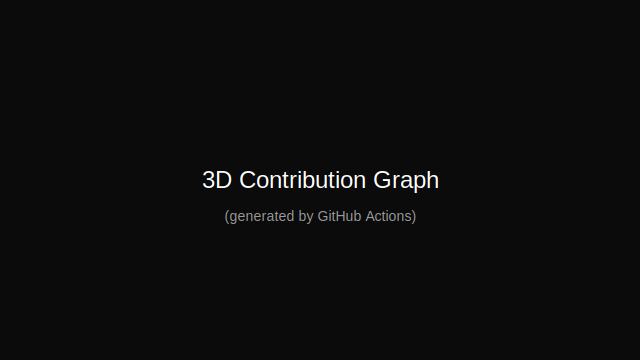

I'm Dr Prabath, currently working as a Lecture in Faculty of Computer Science at University of Applied Sciences Technikum - Wien in Vienna.

Interested in 

* Interoperability in healthcare (HL7/FHIR)
* Secondary Use of Health Data (OMOP-CDM)
* Digital health systems development and implementation
* Health inforamtics
* Bioinformatics
* Mobile & Game Development 

I love making new things. If you have project and you're in need help, let me know, I'm happy to provide you a hand.

<!--
**prabathjayatissa/Prabath_Jayatissa** is a ✨ _special_ ✨ repository because its `README.md` (this file) appears on your GitHub profile.

Here are some ideas to get you started:

- 🔭 I’m currently working on ...
- 🌱 I’m currently learning ...
- 👯 I’m looking to collaborate on ...
- 🤔 I’m looking for help with ...
- 💬 Ask me about ...
- 📫 How to reach me: ...
- 😄 Pronouns: ...
- ⚡ Fun fact: ...
-->

